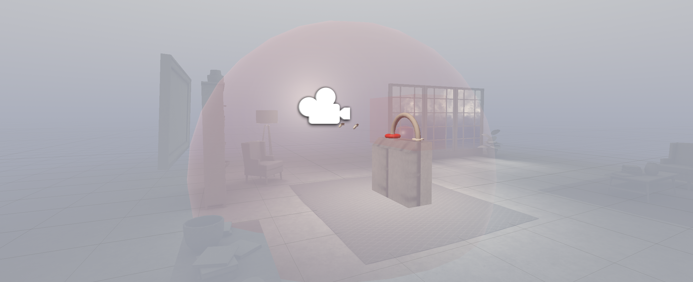

# DM2905 - Assessing VR Teleportation Mechanics Under High Arousal in Fast-Paced Game-like Scenarios

## Teleportation test

Here you can see the teleportation with custom orientation at target position

The BuzzWire backend configuration to detect the player moves and control cheating

## Objective and Research Question
Evaluate whether users perform differently using teleportation techniques under high-arousal-inducing situations than in traditional lab environments without game-like stressors, aiming to answer the following:

- RQ1: How do varying levels of stressors influence user performance and behavior during VR locomotion tasks, particularly teleportation, in environments that naturally induce high arousal states similar to high-paced video games?

## Hypothesis
Reflecting on potential outcomes from the experiment, two possibilities emerge:
1. No significant difference in performance or workload: If stressors like time pressure and cognitive interference don’t notably affect results, this could suggest that lab environments are sufficient for testing VR teleportation methods. This would mean that inducing stress is unnecessary for accurate assessments.
2. Significant impact on performance: If stressors yield noticeable differences in performance and task workload, it would imply that testing VR teleportation in game-like environments that induce challenges might be crucial for obtaining realistic and meaningful results, particularly for applications in gaming and high-arousal contexts.
These results could guide future research directions and the design of VR testing environments.

### Backlog
- [ ] Finish gameloop
    - [x] Connect the condition with the game state
    - [x] Update the game loop to have a practice and trial color sequence
    - [x] GUI for *Start Practice*, then for "Practice complete now" *Start Trial*.
    - [x] GUI once the Trial is completed (Condition fulfilled), *Back to conditions*
    - [ ] The color prompt shows "COLOR" or "WORD" depending on the presence of the congnitive interference
- [x] Menu to hide the conditions
- [x] Confirmation feature to manually reset, terminate and fulfill each condition and the experiment
- [x] Test the conditions manu in VR
- [x] Hide and show the conditions menu
- [ ] Begin the experiment with a subject ID, set the ID either by keyboard input, or random.

### Devlogs

