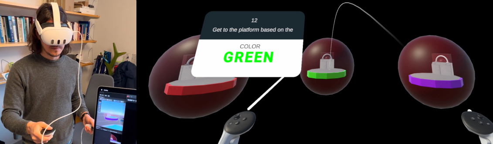
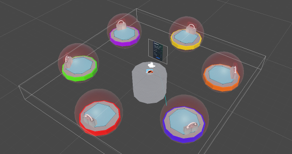
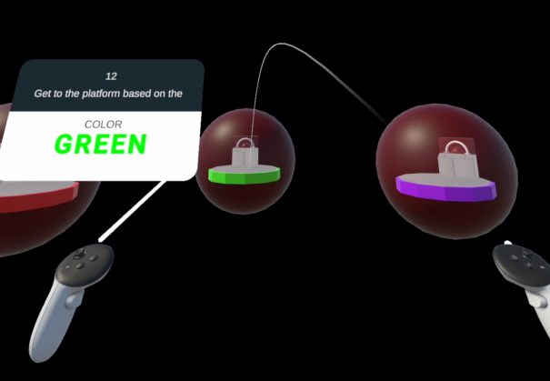
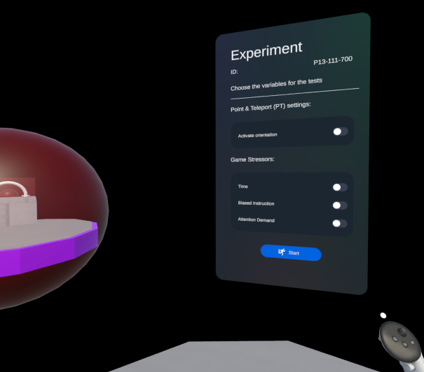
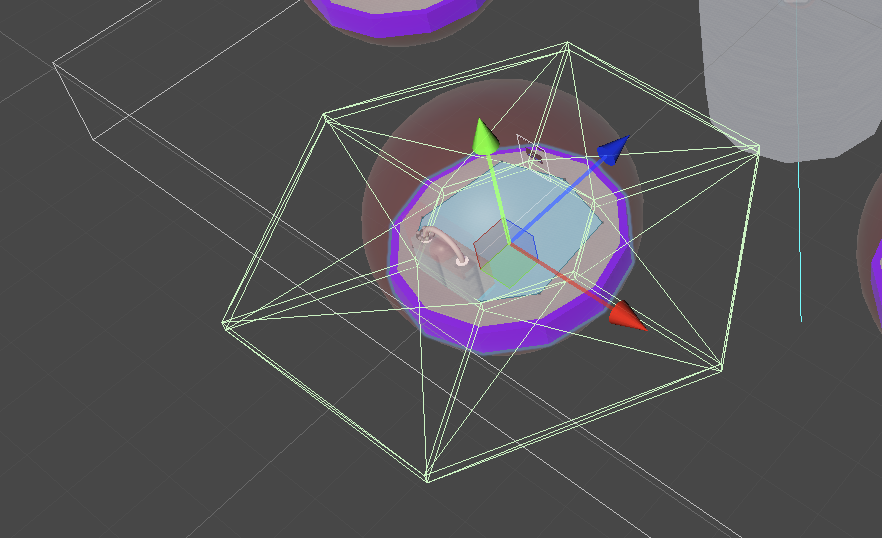

# StressPort: A VR Study Design for Teleportation Under Game-Like Stressful Conditions


## Abstracts
This project includes two distinct reports addressing different subjects: (1) the technical implementation of the evaluation, and (2) a design-oriented approach to VR iterative interaction design.

### Report 1: Incorporating challenges to influence users’ teleportation performance in VR
VR teleportation is a widely adopted technique for synthetic movement in virtual environ- ments. It has been extensively evaluated and modified, as well as placed into game-like scenar- ios where users teleport to collect coins or find targets. Discussions in prior research highlight the interest in including challenges, in-game pressure, or placing the user in fast-paced scenar- ios during teleportation evaluations, suggesting that such contexts may yield more significant differences between methods [4, 10, 16]. Still, no clear examples of the type of challenges are provided or discussed. Building on these discussions, this work presents an implementation of two known teleportation techniques (Point & Teleport and Orientation adjustment), a set of three factors that affect the in-game challenge difficulty, and a study design for their evaluation, coupled with procedural guidelines. The study aims to address the research question: What is the impact of incorporating in-game challenges on users’ teleportation performance in VR environments? Finally, this work outlines experimental considerations and addresses known issues for researchers interested in conducting the proposed study.

[📝 Written report PDF](Reports/David_Giraldo_DM2905_Project_report_2025.pdf)

Supervisor:[ Prof. Andrii Matviienko](https://www.kth.se/profile/amatvi)

### Report 2: Informing VR Teleportation interaction design through a RtD approach
This study explores the iterative design of VR teleportation mechanics through RtD, focusing on usability trade-offs between two interaction models. The first iteration distributed tasks across both hands: the right hand activated teleportation using the "A" button, while the left joystick controlled orientation, enhancing precision but limiting multitasking. The second iteration centralized interaction on the dominant hand by using the trigger button for activation and the joystick for orientation adjustment. This approach improved flexibility, accommodating left-handed users and individuals with limited mobility, but introduced a steeper learning curve and increased user strain. Further evaluation is needed to optimize the balance between efficiency and usability.

[📝 Written report PDF](Reports/David_Giraldo_VR_teleportation_RtD.pdf)

Supervisor:[ Prof. Kristina Höök](https://www.kth.se/profile/khook)

## 📚 Documentation
- About the Unity VR test environment (This page)
- [Backlog and Future Work](/Backlog.md)
- [Devlogs](/sessions_notes.md)
- [References](/Refences.md)
- [About VR Meta SDK](/ABOUT_VR_META.md)

## About the Unity VR test environment
### Objective
Investigate how exposure to game-like stressors affects teleportation performance, perceived stress, and workload in VR environments.

### Motivation
- Gather reliable results from user evaluations with regard to teleportation performance
- Simulating perceived pressure typical of fast-paced video games

### Experience Overview
In this experimental design, the subjects have to teleport between 6 hexagon- layout platforms. Each platform represented a different color (red, blue, green, yellow, orange, and purple). 



Subjects are given one teleportation instruction at a time in the form of color displayed on a VR GUI to move to a destination. Once at the destination platform, they activate a mechanism to cue the system for the next platform.


<div style="display: flex; justify-content: space-between;">
    
     
    
</div>

This instance of the prototype includes two teleportation methods and three game stressors, but further methods and stressors can be added according to the research’s needs.

 

## ⚙️ Dependencies
- Platfrom: Meta Quest 3 VR headset using Meta’s Interaction SDK 
- Unity version 2022.3.46f1 using the Built-in Render Pipeline
- OpenXR SDK and the virtual simulator (powered using Vulkan)
*When the application is installed onto the HMD, the viewport can be streamed to a MacBook Pro via the Meta Quest Developer Hub for real-time monitoring.

## 📂 Directories
The important files can be found in the following locations, any other files are dependencies from pluggings and they must not be removed or edited unless you know what you are doing. The **main scene** is `TeleportationOnRightHandOnly` inside the `/Scenes/Experiment`.
```bash
Project/
├── Assets/
│   ├── Art/
│   │   ├── Images/
│   │   ├── Materials/
│   │   ├── Mesh/
│   │   └── Textures/
│   ├── Prefabs/
│   ├── Scenes/
│   │    ├── Experiment/ TeleportationOnRightHandOnly
│   │    └── Playgrounds/
│   ├── Scriptable Objects/
│   │   └── Platforms/
│   └── Scripts/
│       ├── Controllers/
│       ├── Experiment Variables/
│       ├── Manager/
│       ├── Persistence/
│       └── States/

```
**About Scripts:**
`Controllers`: Manages player and object interactions.
`Experiment Variables`: Handles specific experimental conditions and variables.
`Manager`: Oversees overarching game logic or systems.
`Persistence`: Scripts for saving/loading data.
`States`: State machine implementation for controlling various behaviors.

## 🏗️ Overall architecture

`ExperimentManager`
1. `OnConditionChanged`: Triggered when a new experimental condition is set, notifying subscribers about the change.
2. `OnConditionTerminated`: Invoked when the current experimental condition is forcibly terminated, notifying subscribers about the termination.
3. `OnConditionFulfilled`: Raised when tasks for the current condition are completed successfully, allowing subscribers to react to the condition's fulfillment.
4. `OnExperimentCompleted`: Fired when all experimental conditions are fulfilled, signaling the end of the experiment.
5. `OnExperimentReset`: Activated when the experiment is reset, notifying subscribers to reinitialize or prepare for a new round.

`GameplayManager`
1. `OnPracticeStandby`: Triggered when the player is in a standby state, waiting to manually start the practice tasks.
2. `OnPracticeBegin`: Raised when the player begins performing the practice tasks.
3. `OnPracticeEnd`: Fired when all practice tasks are completed.
4. `OnPracticeEndAndTrialStandby`: Activated after completing all practice tasks, signaling the player can manually begin the trial tasks.
5. `OnTrialStandby`: Triggered when the player is in a standby state, waiting to manually start the trial tasks.
6. `OnTrialBegin`: Invoked when the player starts performing the trial tasks.
7. `OnTrialEnd`: Fired when all trial tasks are completed.
8. `OnGameOver`: Signals the end of the gameplay session, used to clean up or reset state.

`GameState`

**Events**
1. `OnNewSequence`: Raised when a new sequence of task colors is created. Observers can subscribe to this event to receive the stack of colors forming the new sequence.
OnNewNextColor:

2. `Description`: Triggered whenever the next task color is determined during a sequence. Observers receive details about the stimulus type, next color, and whether the previous task was completed successfully.
**Observer-Dependent Methods**
1. `Subscribe(IObserver<GameStateData> observer)`:Adds a new observer to the list of observers. Returns an IDisposable object to allow the observer to unsubscribe later.
2. `NotifyObservers()`:Notifies all registered observers about the current game state change. Sends the updated GameStateData.
3. `NotifyObserversForTheLastTime()`:Sends a final notification to all observers and ensures they are informed of the game's end. It traverses the observer list in reverse to prevent issues when removing observers.

## Features
- **Start:** The primary button on `GameplayGUI` children call `BeginGame` on GameplayManager
**Platforms:** `EnterGameplay` in `ExprimentManager` and in `GameplayManager` triggers the setup of the platforms.
- **Hard exit:** Press both primary buttons for 5 seconds to terminate the task.
- **Color generation:** The colors are generated using a Graph, and a set of coordinates `{ -3, -2, -1, 1, 2, 3 }` that represent the number of steps from the player current position and the direction: `-` left and `+` right. 
`GenerateRandomCoordinateList` inside `GameState`, creates the Graph. Read *Session 2024-11-05: Adding Graph and Distances* for more details.
- **Participant and variables Data:** The information about what stimuli are active in a task is in `ParticipantData` Scriptable Object. The GUI writes directly to its field to toggle variables.
- **Timer:** This variables in controlled by the GameplayManager via the `CountdownToReachPlaform()` method.
- **Biased instruction:** This stimuli is controll inside the `ColorPromptController` class, in the `UpdateColorPromptDisplay()` method. A memeber variable `m_participantData` referencing `ParticipantData` game object expose the property `.GameStressorBiasedInstruction`.
- **Shrinking platforms:** This stimuli is controlled by `ShrinkPlatformController`, this component is attached to a GameObject ShrinkController inside the parent prefab FloatingPlatform. The GameObject TeleportationBlocker is what causes the teleportation area to apparently shrink. It is a torus that bloacks the Nav Mesh.



The design hopes to help advance the understanding of VR teleportation evaluation under game-like stressors and serve as a starting point for future researchers and VR game developers.


